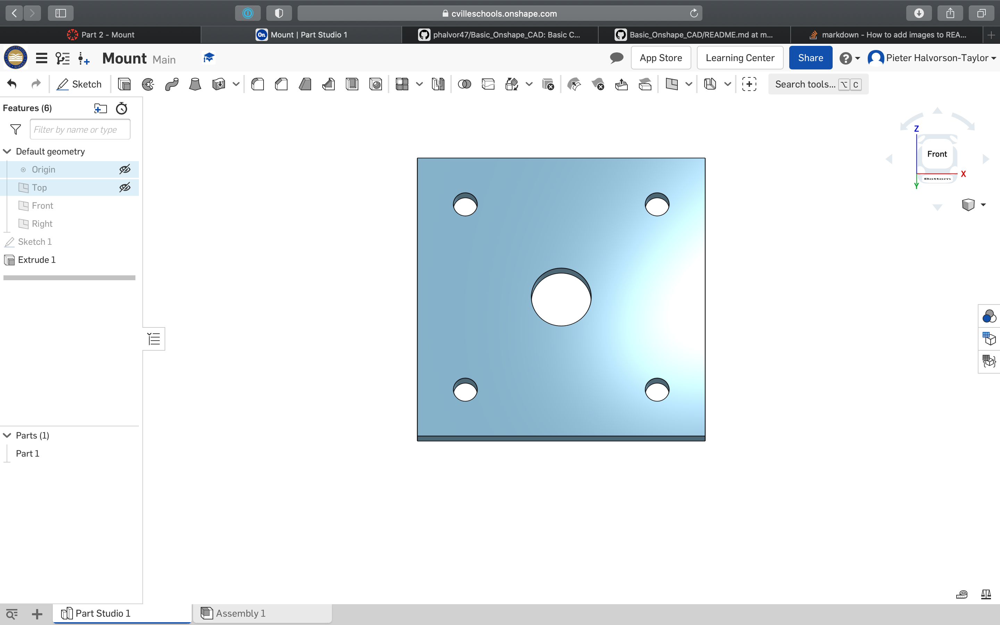

# Basic Onshape CAD

# Base

### What I learnned
* I learned how to create a document in Onshape.
* I learned how to extrude to add or remove in Onshape.

Link to Onshape document: [Base](https://cvilleschools.onshape.com/documents/1e5fb28636b71c6cf9438c18/w/752e45c70b70b4eeea1ae514/e/a9da1f00025655efc3cee953)

# Mount

### What I learned
* I exteded my knowledge on remove extruding.

Link to Onshape document: [Mount](https://cvilleschools.onshape.com/documents/d2d5073b98507d3f443f0e6f/w/1eacab570ae324835e431b34/e/970af448f1ca1a88dd3d7b25)

# Fork

### What I learned
* I extended my knowledge on extrusions in Onshape.
* I learned how to fillet in Onshape.

Link to Onshape document: [Fork](https://cvilleschools.onshape.com/documents/479b3efdaa2d40a79bc1a91e/w/2bab31140c25c35050908721/e/4f7fbbb551a97e88b8d8cb47)

# Tire

### What I learned
* I learned how to revolve in Onshape.
* I learned how to change the appearance of a part in Onshape.

Link to Onshape document: [Tire](https://cvilleschools.onshape.com/documents/7dc1ba4fbc39f571aea81354/w/1bc415d25f9b0301ee59f806/e/d5c001a08631fb1843cf1aea)

# Wheel

### What I learned
* I extended my knowledge on the revolve tool in Onshape.
* I extended my knowledge on filleting in Onshape.
* I learned how to use the circular pattern tool in Onshape.

Link to Onshape document: [Wheel](https://cvilleschools.onshape.com/documents/ff38aca19246d5786bc4eb88/w/858979dc2445ef9b81ef1c1f/e/ae41a281234e320dd4bc814f)

# Axle, Collar, and Washer

### What I learned
* I learned how to "use" an edge.
* l learned how to create a new part while making another part.

Link to Onshape document: [Axle and Collar](https://cvilleschools.onshape.com/documents/35a54cd46d3ae5e6ba556e9f/w/d7bcaba6fb170510d5bb06c8/e/abc75b4dcc4ed2fdd6f67ff9)
Link to Onshape document: [Washer](https://cvilleschools.onshape.com/documents/da18e727c262896ebe75d104/w/4a1bd2cfd5f42c02a7048ba7/e/28ab2e1a293dbd374e04fe15)

# Sub Assembly

### What I learned
* I learned how to make an assembly in Onshape.
* I learned how to make versions of parts in Onshape.
* I learned how to mate, fasten, in Onshape.
* I learned how to do a revolute mate in Onshape.

Link to Onshape document: [Sub Assembly](https://cvilleschools.onshape.com/documents/4e2f33520e60e4a94b61e252/w/4b27304652426ab2deafebc8/e/cb9857bf9d8f6d8056086ce9)

# Assembly

### What I learned
* I learned how to make an assembly with a combination of parts and assemblies in Onshape.
* I extended my knowledge on the fasten and revolute mate in Onshape.
* I learned how to import screws/bolts, nuts, and pins in Onshape.

Link to Onshape document: [Assembly](https://cvilleschools.onshape.com/documents/e9dca43fd2355c69a3a0cdaa/w/a01cb949e690f5938be6f66f/e/f55523675094c02015843118)

# Dorothy's Dowel Pins

### What I learned
* I learned how to create configurations in Onshape.
	* There are multiple ways to make a configuration in Onshape. I used a configuration list. It was quite straight forward since we only needed to click the dimension or action we wanted to configure and add dimensions.
	* To use the configuration, I just have to click a dropdown menu near the top left corner of the page.
* I learned how to create assemblies with configurations in Onshape.
	* It was quite simple to use congigurations in assemblies since when we imported the part, we could choose the configurationt then and generate it.

Link to Onshape document: [Dorothy's Dowel Pins](https://cvilleschools.onshape.com/documents/a98cc56366b128c5aeb68881/w/1b240f4657b1e9ec579a28cd/e/13fff3294b9443657b43d1ce)

# Onshape Challenge

### What I learned
* I learned how to make a Thin Feature
	* In Onshape, a Thin Feature is called Thicken. It is like a Thin Feature but instead of putting one measurement for both sides, you choose  the measurement for both sides.
* I learned how to make a Cylindrical mate
	* The Cylindrical mate is like a Rotating mate but allows for more flexibility vertical length wise

Link to Onshape document: [Full Challenge Assembly](https://cvilleschools.onshape.com/documents/1befb4c92b88bc25b001971b/w/8f8e8186dde8fb57830fb1fe/e/884a1441764003383efdceaa)
Link to Onshape document: [The Cube](https://cvilleschools.onshape.com/documents/5156bed3b840edc1d9181035/w/6189e3913ee141784a14836a/e/03729fb4c3147a67fd1f02f5)
Link to Onshape document: [The Spinner Shaft](https://cvilleschools.onshape.com/documents/5ad16592e2c8c1791ddbd76f/w/1d512a4fda4c4c37763e2e0a/e/5f7ee08bb5c4751959ddc8f5)
Link to Onshape document: [The Bracket](https://cvilleschools.onshape.com/documents/331f3af530594f575e7e31fa/w/2addda16865b005bf632a6fe/e/fc4cf4a7f1100116ee4311a0)

