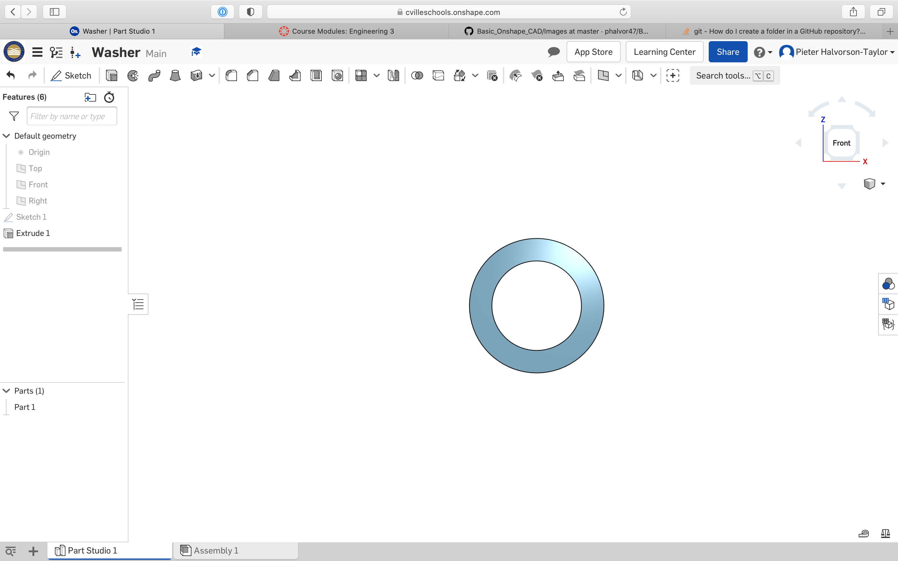

# Basic Onshape CAD

# Base

### What I learnned
* I learned how to create a document in Onshape
* I learned how to extrude to add or remove in Onshape

# Mount

### What I learned
* I exteded my knowledge on remove extruding

# Fork

### What I learned
* I extended my knowledge on extrusions in Onshape
* I learned how to fillet in Onshape

# Tire

### What I learned
* I learned how to revolve in Onshape
* I learned how to change the appearance of a part in Onshape

# Wheel

### What I learned
* I extended my knowledge on the revolve tool in Onshape
* I extended my knowledge on filleting in Onshape
* I learned how to use the circular pattern tool in Onshape

# Axle, Bearing, and Washer

### What I learned
* I learned how to "use" an edge
* l learned how to create a new part while making another part

# Sub Assembly

### What I learned
* I learned how to make an assembly in Onshape
* I learned how to make versions of parts in Onshape
* I learned how to mate, fasten, in Onshape
* I learned how to do a revolute mate in Onshape

# Assembly

### What I learned
* I learned how to make an assembly with a combination of parts and assemblies in Onshape
* I extended my knowledge on the fasten and revolute mate in Onshape
* I learned how to import screws/bolts, nuts, and pins in Onshape

